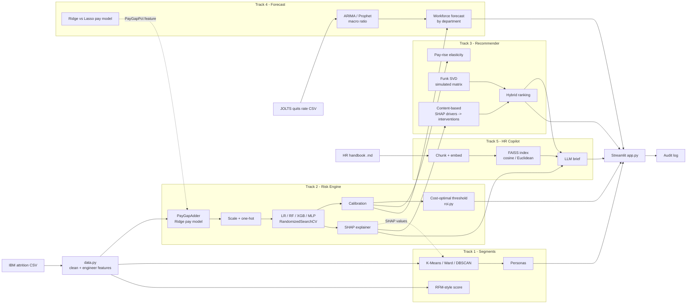

# Architecture

## Data flow

1. `train.py` loads and prepares the data, then splits it 80/20 with stratification. The 20% test set is the "current workforce" in the app, so every score shown there is out of sample.
2. Everything that learns from data (pay model, scaler, encoder, SMOTE, classifier) sits inside one pipeline. Cross-validation re-fits it per fold, so no validation information leaks into training.
3. The decision threshold is chosen on **out-of-fold training predictions**. The test set is used once, for the final report.
4. `train.py` saves a single bundle plus `reports/metrics.json`. The app loads the bundle and runs inference live, including on uploaded CSVs.

## Design decisions to defend

| Decision | Why | Alternative considered |
|---|---|---|
| PR-AUC as the primary metric | 16% positives; accuracy is misleading | ROC-AUC (reported too) |
| Cost-based threshold | Errors have different costs | Fixed 0.5 |
| Platt (sigmoid) calibration | ~190 leavers is too few for isotonic | Isotonic |
| Pay gap as a pipeline step | Prevents leakage across CV folds | Pre-computing on all data |
| Sensitive features excluded | Fairness and policy risk | Include, then audit |
| Test set as app workforce | Honest out-of-sample demo | Scoring training rows |
| TF-IDF fallback for embeddings | Demo works offline | Fail without the model |
