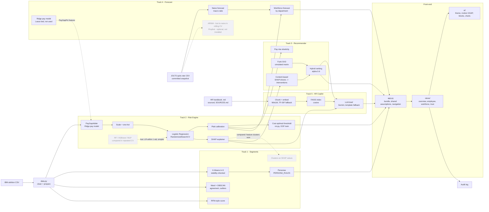

# Architecture

Solid arrows are the live path the app uses. Dotted boxes were compared during the build and lost (or are optional); they stay in `train.py` / `experiments/` as evidence for the defence, not as part of what the app runs.

## Page map

| Page (`views/`) | Shows | Tracks | Main calls |
|---|---|---|---|
| Overview | Workforce dot field, KPIs, risk register, budget plan | 2 | `roi.roi_summary`, `roi.budget_allocation` |
| Employee deep-dive | Why (SHAP) -> what-if -> retention plan -> HR copilot | 2, 3, 5 | `recommend.hybrid_recommend`, `recommend.salary_elasticity`, `rag.Retriever`, `rag.generate`, `audit.log_prediction` |
| Workforce | Segments + DBSCAN outliers + RFM bands, 12-month forecast, pay fairness | 1, 4 | `segment.persona_names`, `forecast.workforce_forecast` |
| Model & trust | Model card, fairness, error analysis, figures, audit log | 2 | `audit.read_log`, `reports/figures/` |

`app_classic.py` is the previous single-page layout (7 tabs), kept as a fallback. It reads the same bundle.

## Data flow

1. `train.py` loads and prepares the data, then splits it 80/20 with stratification. The 20% test set is the "current workforce" in the app, so every score shown there is out of sample.
2. Everything that learns from data (pay model, scaler, encoder, classifier; SMOTE only for the MLP candidate) sits inside one pipeline. Cross-validation re-fits it per fold, so no validation information leaks into training.
3. The decision threshold is chosen on **out-of-fold training predictions**. The test set is used once, for the final report. The app re-optimises the threshold on the same OOF predictions when the user changes the business assumptions.
4. `train.py` saves a single bundle (`models/attritioniq_bundle.joblib`) plus `reports/metrics.json` and the figures. The app loads these and runs inference live, including on uploaded CSVs.
5. Optional dependencies change one thing each and are recorded: `sentence-transformers` present -> MiniLM embeddings (else TF-IDF; `metrics.json -> rag_retrieval.embedding_backend`); LLM key present -> Gemini brief (else template); `faiss-cpu` present -> FAISS (else NumPy search).

## Design decisions to defend

| Decision | Why | Alternative considered |
|---|---|---|
| PR-AUC as the primary metric | 16% positives; accuracy is misleading | ROC-AUC (reported too) |
| Logistic Regression | Within one std of the best CV PR-AUC, simplest and most explainable | RF, XGBoost, MLP |
| Cost-based threshold | Errors have different costs | Fixed 0.5 |
| Platt (sigmoid) calibration | ~190 leavers is too few for isotonic | Isotonic |
| Pay gap as a pipeline step | Prevents leakage across CV folds | Pre-computing on all data |
| Sensitive features excluded | Fairness and policy risk; including them adds +0.007 PR-AUC | Include, then audit |
| Test set as app workforce | Honest out-of-sample demo | Scoring training rows |
| k = 3 segments | Best silhouette among k = 3-6 (all pass ARI 0.6) and far the most stable (ARI 0.98 vs 0.64-0.71) | k = 4-6, SHAP clusters (Cramer's V 0.20 vs 0.27) |
| Naive macro forecast | ARIMA(2,1,3) lost in rolling CV (MAE 0.197 vs 0.179) | ARIMA, Prophet |
| MiniLM embeddings, cosine | hit@1 0.88 vs 0.79 for TF-IDF | TF-IDF, Euclidean |
| TF-IDF and template fallbacks | Demo works offline and on small hosts | Fail without the model or key |
